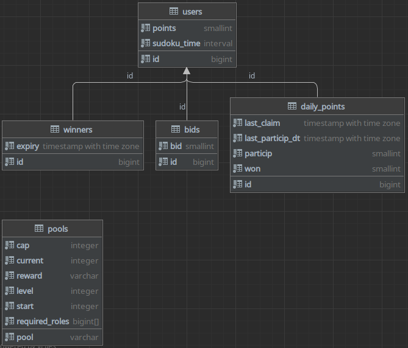

## Users

```sql
CREATE TABLE users
(
    id BIGINT NOT NULL CONSTRAINT points_pk PRIMARY KEY,
    points SMALLINT DEFAULT 0 NOT NULL,
    sudoku_time INTERVAL DEFAULT '1 day'::INTERVAL
);

```

- `id`: The user's unique ID, primary key.
- `points`: The user's points.
- `sudoku_time`: The user's sudoku time, ie. how long it takes them to solve a sudoku.

## Winners

```sql
CREATE TABLE winners
(
    id BIGINT
        CONSTRAINT winners_pk PRIMARY KEY 
        CONSTRAINT winners_users_id_fk REFERENCES users(id)
        ON UPDATE CASCADE ON DELETE CASCADE,
    expiry TIMESTAMP WITH TIME ZONE NOT NULL
);
```

 - `id`: The user's unique ID, primary key, foreign key.
 - `expiry`: The time at which the user's win status expires.

## Bids

```sql
CREATE TABLE bids
(
    id BIGINT
        CONSTRAINT bids_pk PRIMARY KEY
        CONSTRAINT bids_user_id_fk REFERENCES users(id)
            ON UPDATE CASCADE ON DELETE CASCADE,
    bid SMALLINT NOT NULL
);
```

 - `id`: The user's unique ID, primary key, foreign key.
 - `bid`: The user's bid.

## Daily Points

```sql
CREATE TABLE daily_points
(
    id BIGINT
        CONSTRAINT daily_points_pk PRIMARY KEY
        CONSTRAINT daily_points_users_id_fk REFERENCES users(id)
            ON UPDATE CASCADE ON DELETE CASCADE,
    last_claim TIMESTAMP WITH TIME ZONE NOT NULL,
    last_particip_dt TIMESTAMP WITH TIME ZONE NOT NULL,
    particip SMALLINT DEFAULT 0 NOT NULL,
    won SMALLINT DEFAULT 0 NOT NULL
);
```

 - `id`: The user's unique ID, primary key, foreign key.
 - `last_claim`: The last time the user claimed their daily points.
 - `last_particip_dt`: The last time the user participated in the daily points.
 - `particip`: The number of participation points the user has won on the day.
 - `won`: The number of bonus points the user has won on the day.

## Pools

```sql
CREATE TABLE pools
(
    pool VARCHAR NOT NULL CONSTRAINT pools_pk PRIMARY KEY,
    cap INTEGER NOT NULL,
    current INTEGER DEFAULT 0 NOT NULL,
    reward VARCHAR NOT NULL,
    level INTEGER DEFAULT 1 NOT NULL,
    start INTEGER default 0 NOT NULL,
    required_roles BIGINT[] DEFAULT '{225345178955808768}'::BIGINT[] NOT NULL 
);
```

 - `pool`: The pool's name, primary key.
 - `cap`: The pool's capacity.
 - `current`: The pool's current size.
 - `reward`: The pool's reward.
 - `level`: The pool's level.
 - `start`: The pool's start date.
 - `required_roles`: The pool's required roles to participate.

## Back to [top](./database) / [features](.)
