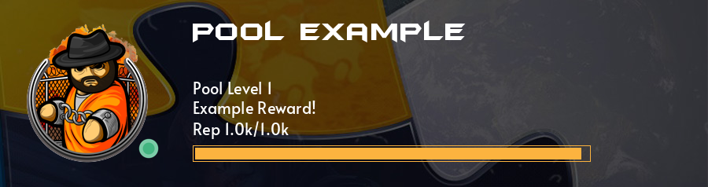

# Pools

Example:


- The pool card generation is a modification of [disrank's](https://github.com/shahriyardx/disrank) generation code. 

## Checks

```python
async def interaction_check(self, interaction: Interaction) -> bool:
    member = interaction.user
    assert isinstance(member, discord.Member)
    roles: list[int] | None = await self.bot.pool.fetchval(
        "SELECT required_roles FROM pools WHERE pool = $1",
        interaction.namespace["pool"]
    )
    if roles is None:
        raise errors.NoPoolFound(MESSAGE)
    if not any(role.id in roles for role in member.roles):
        raise errors.NoPoolFound(interaction.namespace["pool"])
    if interaction.channel_id != 969972085445238784:
        raise errors.WrongChannelError(969972085445238784)
    return True
```

 - You have to have a pool role to use this command.
 - You have to be in the right channel to use this command.
 - The pool has to exist

## Add

- `/pool add <pool> <amount: [int >=1]>`
- Pool is an autocomplete string field of the pool to add points to.
- Amount is the amount of points to add, has to be a valid positive integer of at least 1 that conforms to
  [Discord's integer definition][OPTION_TYPES] for your locale. (See [INTEGER][OPTION_TYPES] for more information).
- You have to have enough points to add, and the pool has to exist and not be full.

## Query

 - `/pool query <pool>`
 - Pool is an autocomplete string field of the pool to query.
 - You have to pass the interaction checks and have enough points.

## Back to [top](./pools) / [features](.)

[OPTION_TYPES]: https://discord.com/developers/docs/interactions/application-commands#application-command-object-application-command-option-type